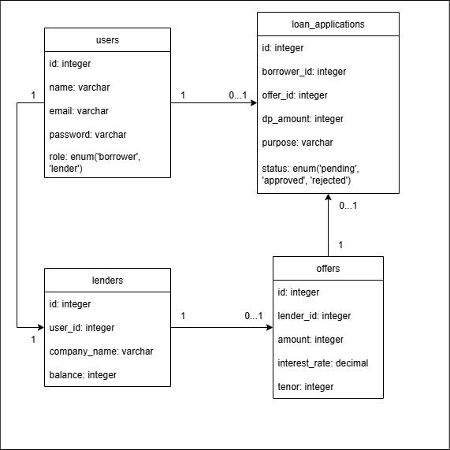

# Loan Marketplace
Platform pinjaman online.

## Fitur Utama
- **Borrower:**: ajukan pinjaman, lihat penawaran, pilih produk pinjaman.
- **Lender:**: kelola data penawaran, dan aplikasi pinjaman.
- Perhitungan cicilan dengan bunga tetap.

## System Requirements
- PHP ^8.2
- Composer
- Node.js
- MySQL

## Instalasi
- Clone project dengan `git clone https://github.com/nafbeckh/loan-marketplace.git`
- Masuk ke direktori `loan-marketplace` dengan `cd loan-marketplace`
- Install semua dependensi\library `composer install` dan `npm install`
- Jalankan build `npm run build`
- Copy file `.env` dengan `cp .env.example .env`
- Generate key dengan `php artisan key:generate`
- Sesuaikan environtment di file `.env`
- Migrasi database `php artisan migrate --seed`
- Jalankan server `php artisan serv`

## Struktur Role
- **Borrower:** → akses melalui route biasa
- **Lender:** → akses melalui Filament panel /lender

## ERD

## Flowchart

### Borrower
### Lender

## Data Seeder
### Lender
| No | Email             | Password | 
|----|-------------------|----------|
| 1  | lender@gmail.com  | lender   |
| 2  | lender2@gmail.com | lender2  |

### Offers
| No | Lender    | Jumlah Pinjaman | Bunga per tahun | Tenor    | Angsuran per bulan |
|----|-----------|-----------------|-----------------|----------|--------------------|
| 1  | Bank ABCD |   Rp 15.000.000 | 8.75%           | 12 bulan |       Rp 1.359.375 |
| 2  | Bank ABCD |   Rp 10.000.000 | 7%              | 6 bulan  |       Rp 1.725.000 |
| 3  | Bank ABCD |   Rp 25.000.000 | 9.5%            | 24 bulan |       Rp 1.239.583 |
| 4  | Bank EFGH |   Rp 15.000.000 | 7.25%           | 12 bulan |       Rp 1.340.625 |
| 5  | Bank EFGH |   Rp 10.000.000 | 7.25%           | 6 bulan  |       Rp 1.727.083 |
| 6  | Bank EFGH |   Rp 50.000.000 | 10%             | 36 bulan |       Rp 1.805.555 |

**Note:** Angsuran per bulan akan menyesuaikan dengan jumlah pinjaman dikurang dengan jumlah uang muka yang telah diinputkan borrower.
