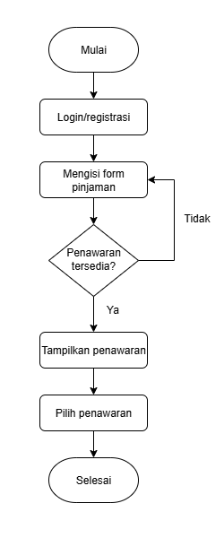
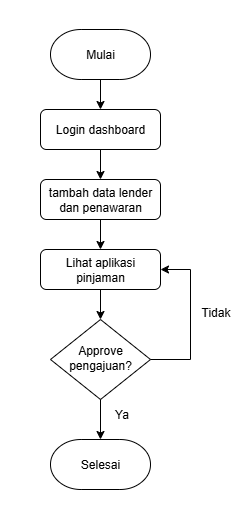
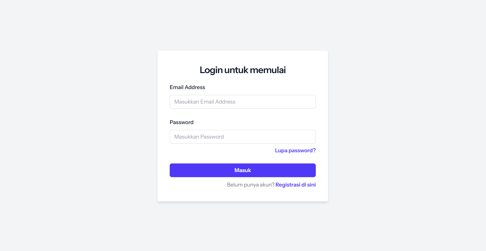
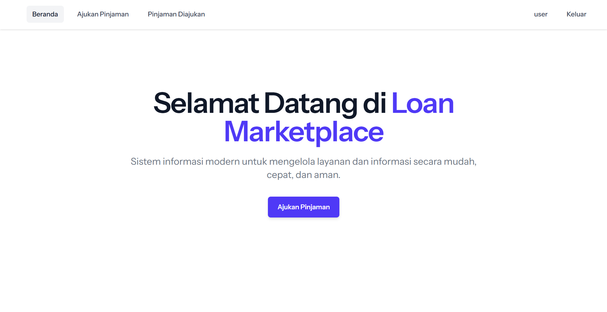
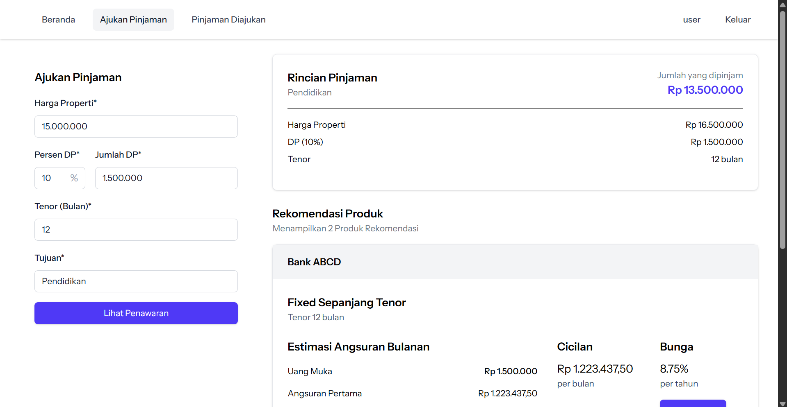
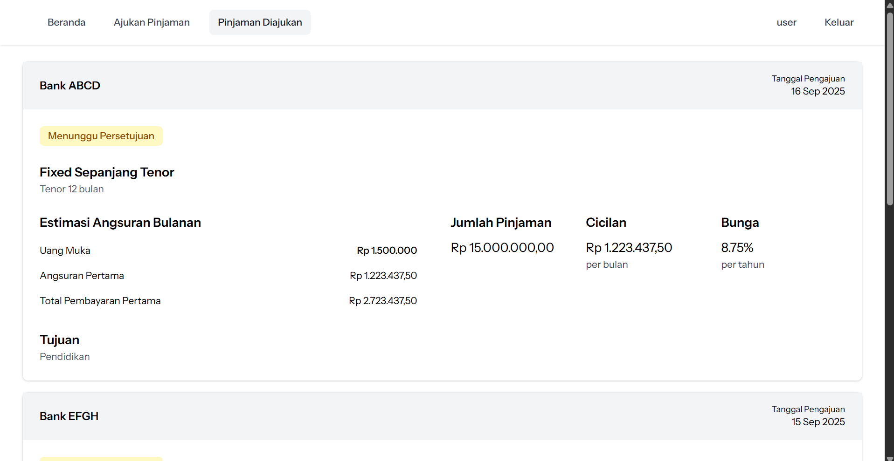
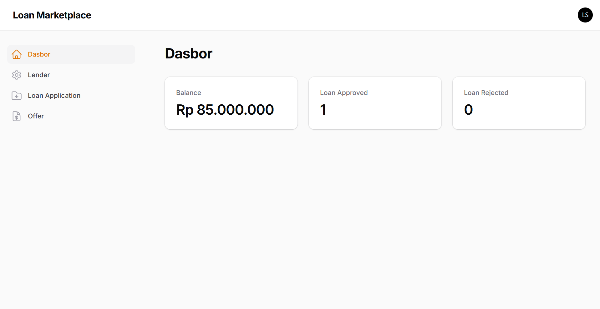
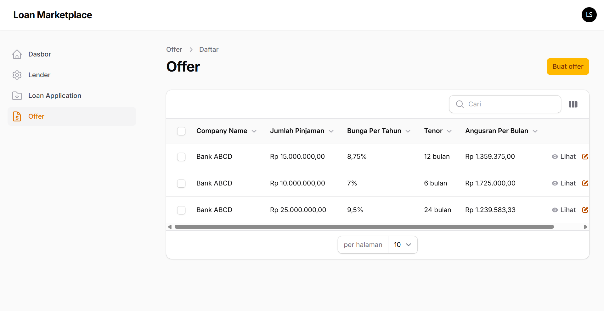
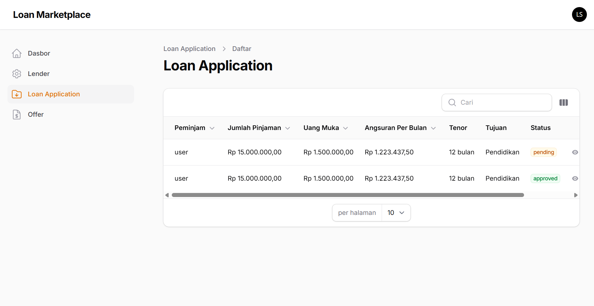

# Loan Marketplace
Platform pinjaman online.

## Fitur Utama
- **Borrower:** Ajukan pinjaman, lihat penawaran, pilih produk pinjaman.
- **Lender:** Kelola data penawaran, dan aplikasi pinjaman.
- Perhitungan cicilan dengan bunga tetap.
- Menggunakan <a href="https://laravel.com/docs/12.x/releases">Laravel 12</a>, <a href="https://filamentphp.com/">Filament</a> dan <a href="https://tailwindcss.com/">TailwindCSS</a>

## System Requirements
- PHP ^8.2
- Composer
- Node.js
- MySQL

## Instalasi
- Clone project dengan `git clone https://github.com/nafbeckh/loan-marketplace.git`
- Masuk ke direktori `loan-marketplace` dengan `cd loan-marketplace`
- Install semua dependensi\library `composer install` dan `npm install`
- Jalankan build `npm run build`
- Copy file `.env` dengan `cp .env.example .env`
- Generate key dengan `php artisan key:generate`
- Sesuaikan environtment di file `.env`
- Migrasi database `php artisan migrate --seed`
- Jalankan server `php artisan serv`

## Struktur Role
- **Borrower:** → akses melalui route biasa
- **Lender:** → akses melalui Filament panel /lender

## ERD
- users one to one lenders
- lender one to mary offers
- offers one to many loan_applications
- loan_applications many to one users

## Diagram Alur
### Borrower

1. Login atau registrasi akun
2. Mengisi form pengajuan pinjaman
3. Jika tidak ada penawaran yang sesuai dengan pinjaman yang diajukan maka isi form pengajuan ulang, Jika ada maka tampilkan list penawaran
4. Pilih produk penawaran.

### Lender

1. Login dashboard lender
2. Isi data lender dan tambah data penawaran
3. Lihat aplikasi pinjaman
4. Approve atau reject pinjaman yang telah diajukan borrower. 

## Data Seeder
### Lender
| No | Email             | Password | 
|----|-------------------|----------|
| 1  | lender@gmail.com  | lender   |
| 2  | lender2@gmail.com | lender2  |

### Offers
| No | Lender    | Jumlah Pinjaman | Bunga per tahun | Tenor    | Angsuran per bulan |
|----|-----------|-----------------|-----------------|----------|--------------------|
| 1  | Bank ABCD |   Rp 15.000.000 | 8.75%           | 12 bulan |       Rp 1.359.375 |
| 2  | Bank ABCD |   Rp 10.000.000 | 7%              | 6 bulan  |       Rp 1.725.000 |
| 3  | Bank ABCD |   Rp 25.000.000 | 9.5%            | 24 bulan |       Rp 1.239.583 |
| 4  | Bank EFGH |   Rp 15.000.000 | 7.25%           | 12 bulan |       Rp 1.340.625 |
| 5  | Bank EFGH |   Rp 10.000.000 | 7.25%           | 6 bulan  |       Rp 1.727.083 |
| 6  | Bank EFGH |   Rp 50.000.000 | 10%             | 36 bulan |       Rp 1.805.555 |

**Note:** Angsuran per bulan akan menyesuaikan dengan jumlah pinjaman dikurang dengan jumlah uang muka yang telah diinputkan borrower.

## Simulasi Penawaran
- **Amount** = jumlah pinjaman (principal)
- **DP** = jumlah uang muka pinjaman (principal)
- **Tenor** = durasi pinjaman dalam bulan
- **Interest Rate** = tingkat bunga per tahun (%)
- **I** = bunga bulanan

**Rumus perhitungan:**

1. I = (Interest Rate / 100) x 12
2. Total Amount = Amount - DP
3. Installment = (Total Amount + (Total Amount × I × Tenor)) / Tenor

**Contoh:**

- Amount = 15.000.000
- DP = 1.500.000
- Tenor = 12 bulan
- Interest Rate = 8.75%

**Perhitungan:**
1. I = (8.75 / 100) / 12 ≈ 0.007291666
2. Total Amount = 15.000.000 - 1.500.000 ≈ 13.500.000
3. Installment = (13.500.000 + (13.500.000 x 0.007291666 x 12)) / 12 ≈ 1.223.437,50

## Screenshot
### Borrower
**Login**

**Home**

**Form Pinjaman**

**Pinjaman yang Diajukan**

### Lender
**Dashboard**

**Offers**

**Loan Application**

